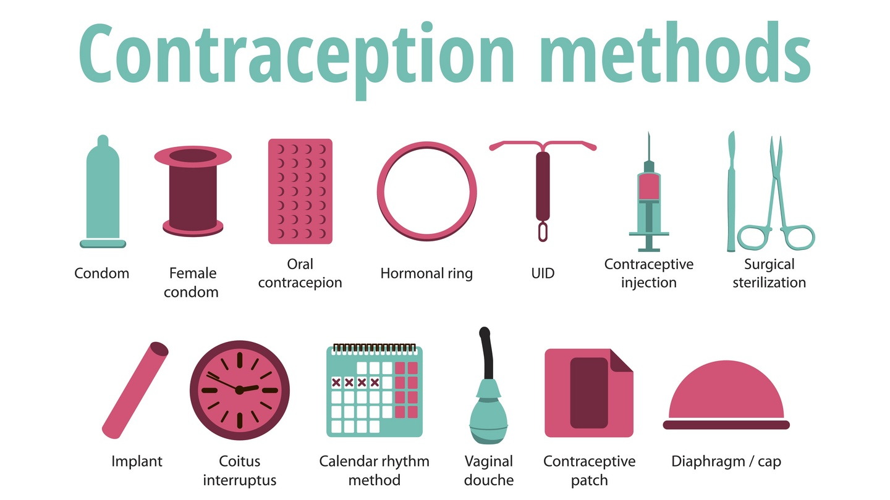

# Contraceptive Method Public Health Project
In this project, we examine a dataset of contraceptive methods used by married Indonesian women to see insights and predictions can be made based on various demographic and socioeconomic variables.

The goal was to make informed recommendations to public health officials in order to help them target their educational programs to women who are less likely to be using contraception. This can have an impact in reducing unwanted pregnancy, abortion rates, birth complications, infant and maternal mortality rates.

# Data
Our [dataset](https://archive.ics.uci.edu/ml/datasets/Contraceptive+Method+Choice) comes from the [UC Irvine Machine Learning Repository](https://archive.ics.uci.edu/ml/index.php), used with permission.

## Features Examined
Feature Name             |  Type         |     Values
:------------------------|:--------------|-------------:
Woman's age              | numerical     | 
Woman's education        | categorical   | 1 = low, 2, 3, 4 = high
Husband's education      | categorical   | 1 = low, 2, 3, 4 = high
Number of children       | numerical     | 
Wife's religion          | binary        | 0 = Non-Islam, 1 = Islam
Wife's now working?      | binary        | 0 = Yes, 1 = No
Husband's occupation     | categorical   | 1, 2, 3, 4
Standard-of-living index | categorical   | 1 = low, 2, 3, 4 = high
Media exposure           | binary        | 0 = Good, 1 = Not good

## Target Variable
Feature Name             |  Type           |     Values
:------------------------|:----------------|-------------:
Contraceptive method used| class attribute |  1 = No-use   2 = Long-term method   3 = Short-term method 

# Analysis
We leveraged machine learning models from [Scikit-learn](https://scikit-learn.org/stable/) to determine the relationship between the features and the target variable. We also performed statistical analysis via [SciPy Stats](https://docs.scipy.org/doc/scipy/reference/stats.html) to further make inferences on the data.

# Findings

# Conclusions

# Authors
Alexander Xin & Mike Flanagan
